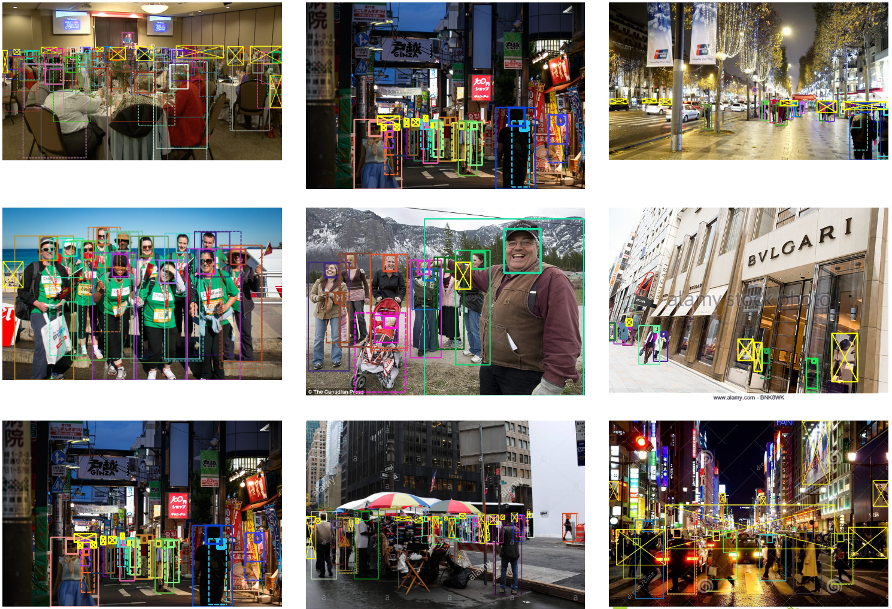

# Human-detection

### Introduction:

- 以人为中心的视频分析技术构建

将会使用的技术：行人检测、人脸微表情、视频分类、人脸识别

---

### simple & strong & faster：

- YOLOV3为baseline
- 参考文章：V4、Centernet、DetectoRS、coco比赛何凯明全家桶、Deformable Convolution、Hourglass network
- 加入DIOU loss(听说比较好用)
- 感受野模块ASPP+Self_Attention
- 更换激活函数（mish serise）
- 加入分层预测计划（参见英伟达语义分割最新工作）

---

### 论坛：

- 1.知乎yunyang关于yolov3实现以及 tf2.0 code

​      地址：

- 2.参见知乎各种基于IOU的loss，一定要看懂原理和实测

​      地址：

以上内容个人理解，可尽情添加。

---

